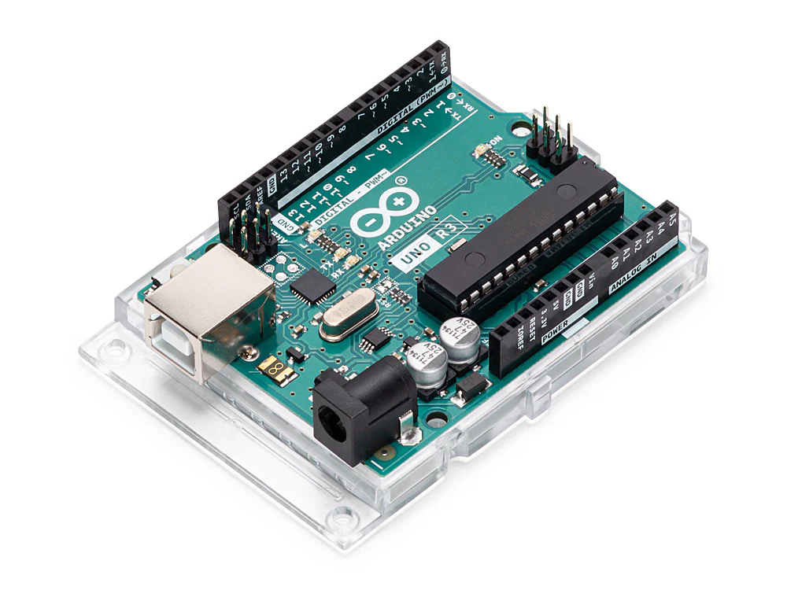
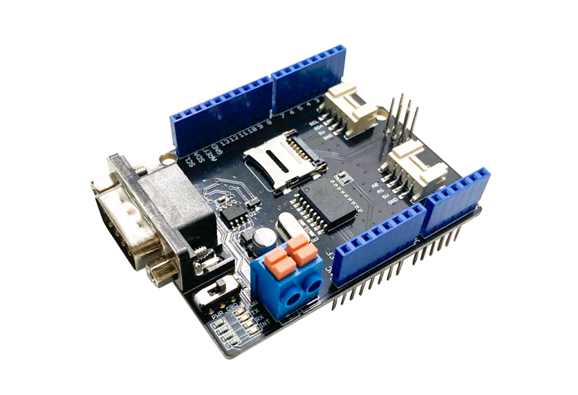
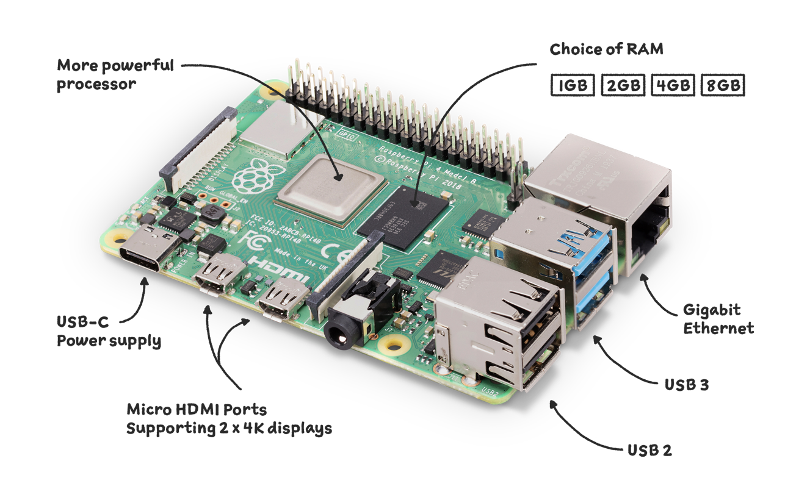
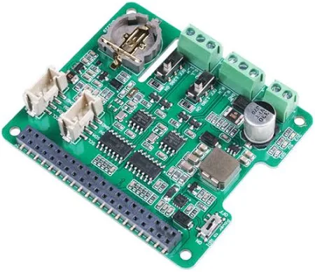
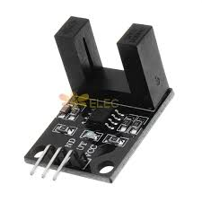
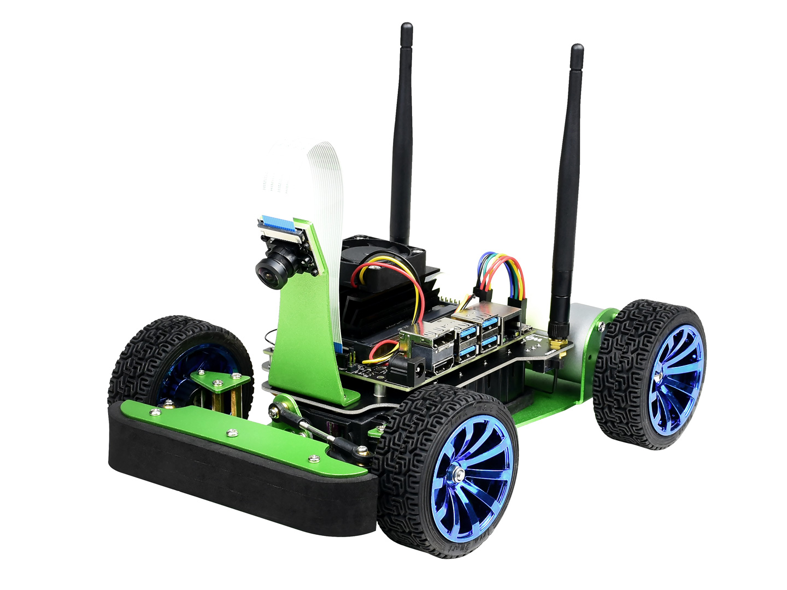

# **DES Project - Instrument Cluster**

- [**DES Project - Instrument Cluster**](#des-project---instrument-cluster)
  - [Introduction](#introduction)
  - [Software Components](#Software-Components)
  - [Hardware Components](#Hardware-Components)
  - [System Architecture](#System-Architecture)
  - [Module Descriptions](#Module-Descriptions)
  - [Installation and Usage](#Installation-and-Usage)

## Contributor


| NAME   | ROLE                  | GitHub                      | LinkedIn                                | Email              |
|--------|-----------------------|-----------------------------|-----------------------------------------|---------------------|
| Soonwoong | Software Engineer | [GitHub profile](https://github.com/mechsoon) | [LinkedIn](https://www.linkedin.com/in/Sunung/) | ksw5190@gmail.com |
| Seungjoo  | GUI Developer      | [GitHub profile](https://github.com/programerKim)  | [LinkedIn](https://www.linkedin.com/in/Jisoo/)  | kimseungjue@gmail.com |
| Kunho | Hardware Developer          | [GitHub profile](https://github.com/Minjae) | [LinkedIn](https://www.linkedin.com/in/Minjae/) | minjae@example.com |

## Introduction

The PiRacer instrument cluster Qt application project is aimed at creating a real-time speedometer for a PiRacer car. The application will run on a Raspberry Pi and receive speed data from a speed sensor via the in-vehicle communication using Controller Area Network (CAN) protocol. This project will provide an opportunity for students to gain practical experience in software engineering, specifically in the areas of embedded systems, software architecture, and communication protocols. The project will also allow students to gain knowledge of the GUI frameworks (eg. Qt), that are widely used in the automotive industry for developing many embedded applications. The successful completion of this project will demonstrate the students' ability to design and implement a real-world software solution, and their ability to effectively communicate their results.  
</br>


## Software Components

- Get data from Speed Sensor: Collecting Data from Speed sensor using an Arduino UNO board.

- Controller Area Network(CAN) protocol: Sending data from Arduino to Raspberry Pi by using CAN-Shield and CAN-Hat.

- Graphical user interface: Making GUI of QT Application to visualize received data by using QML code in QT.

- Cross-Compile: Cross-Compile Raspberry Pi by using Docker and Git-hub action.

- I2C Communication(Bonus part): Receiving battery data by using I2c Communication. Next, visualize it.
## Hardware Components

| **Components**                                     | **image**                                                  |
|----------------------------------------------|-------------------------------------------------------------|
| **Arduino UNO**                              |  |
| **CAN-BUS Shield V2.0** (Seeed Studio) or **MCP2515** | |
| **Raspberry Pi 4** Model B 8GB RAM           |  |
| **CAN-BUS (FD) HAT for Raspberry Pi** (Seeed Studio) |   |
| **Speed Sensor (LM393)**                     |   |
| **Pi Racer**                                 |     |


## System Architecture

[Speed Sensor] -> [Arduino UNO] -> [Arduino CAN Shield] -> [CAN Bus] -> [Raspberry Pi] -> [Raspberry Pi CAN HAT] -> [Qt Application]
[I2C Battery Module] -> [Raspberry Pi] -> [Qt Application]

## Module Descriptions

Arduino Module:

- **CAN Shield**: Collects speed sensor data from the vehicle and transmits it via the CAN protocol to the Raspberry Pi.
- **I2C Communication**: In the bonus part, the Arduino collects battery data via I2C.

Raspberry Pi:

- **CAN HAT**: Receives data from the CAN shield and relays it to the Raspberry Pi.
- **I2C Interface**: Directly collects battery data and forwards it to the Qt application.

Qt Application:

- **Dashboard UI**: Visualizes the received speed and battery data in real-time.
- **Data Communication**: Receives CAN and I2C data from the Raspberry Pi and processes it.


##  Installation and Usage

Tested on the following Hardware:

- Raspberry Pi 4 Model B 8GB

Tested on the following distributions:

- Raspberry Pi OS Lite "Bookworm (64-Bit)
- Ubuntu Server 20.04.5 LTS (64-Bit)

## Piracer setup 

```bash
$ cd ~
$ mkdir piracer_test/
$ cd piracer_test/
$ python3 -m venv venv
$ source venv/bin/activate     //activate virtualenvironment   

$ pip install piracer-py

```


## Raspberry Pi Setup
- CAN configuration
```bash
 $ sudo vim /boot/firmware/config.txt
 add the following line to the end of the config.txt file
 $ dtoverlay=seeed-can-fd-hat-v1 
```
you need to check your CAN-HAT version

- how to activate CAN
```bash
$ apt-get install can-utils
$ sudo ip link set can0 up type can bitrate 500000
$ candump can0
```

- How to enable I2C
```bash
$ sudo raspi-config (select Interfacing Options)
$ Enable I2C
$ reboot
```
How to check which I2C port we are using
```bash
$ i2cdetect -y 1
```
If you want to use Display, add following line to the end of config.txt file. 
[reference for LCD](https://www.waveshare.com/wiki/7.9inch_DSI_LCD)
```bash
dtoverlay=vc4-kms-v3d
#DSI1 Use
dtoverlay=vc4-kms-dsi-waveshare-panel,7_9_inch
#DSI0 Use
#dtoverlay=vc4-kms-dsi-waveshare-panel,7_9_inch,dsi0
```
</br>

## Docker with CICD 

Host machine has X86-64 architecture and Raspberry Pi has ARM CPUs. To run the program on Rpi which compiled by host machine, we need to make an environment for crosscompile.

### requirements
- above QT 6 version
- QEMU
- Docker BUILDX
- Docker image (mechsoon/raspimage:v1)

Our workflows is [Action yml](.github/workflows/practice.yml)
```bash
how to use our workflow

1. simply push your project to main branch
2. CMakeLists.txt should be out of your project file

├── CMakeLists.txt
├── src
│   ├── battery.cpp
│   ├── battery.h
│   ├── battery.png
│   ├── Cluster.qml
│   ├── framefffinal.png
│   ├── low_battery.png
│   ├── main.cpp
│   ├── Main.qml
│   ├── needle_battery.png
│   ├── needle.png
│   ├── resources.qrc
│   ├── SpeedContoller+EMA.cpp
│   ├── SpeedController.cpp
│   ├── SpeedController.h
└── └── SpeedController_KF.cpp
3. if you use other version of QT, you need to modify Dockerimage.
4. Receive Artifacts which contatins crosscompiled program, *.qml with bash script on Raspberry-pi  
```
```bash
# how to run the code on Rpi
# open the crontab using following line
$ crontab -e
# bash file will be execute every 5 minutes when you use following line
$ */5 * * * * /path/to/example.sh
# check the status of cron file
$ crontab -l
```


## DEMO

The PiRacer Instrument Cluster Qt Application project is expected to take approximately 6-8 weeks to complete, with the following estimated timeline:

* Week 1-2:
  * Research and familiarization with the CAN bus protocol, speed sensors, and Qt.
  * Design of the system architecture and software design.

* Week 3-4:
  * Implementation of the Qt-based GUI for the instrument cluster.
  * Integration of the speed sensor with the Raspberry Pi using the CAN bus protocol.

* Week 5-6:
  * Testing and debugging of the instrument cluster.
  * Verification of real-time speed data display on the instrument cluster GUI.

* Week 7-8:
  * Final documentation and report writing, including a detailed explanation of the system architecture, software design, implementation, results, and conclusions.
  * Preparation for final presentation and demonstration.
</br>


